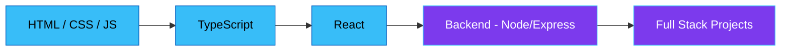

<p align="center">
  
</p>

<h1 align="center">Hi there, I'm Rewan Ahmed 👋</h1>
<h3 align="center">Computer Science & Engineering Student | Frontend Developer</h3>

<p align="center">
  
</p>

<p align="center">
  <a href="https://www.linkedin.com/in/redowan-ahmed-604610418/">
    
  </a>
  <a href="mailto:redowan12521126@gmail.com">
    
  </a>
  <a href="https://github.com/redowan-dot">
    
  </a>
</p>

<p align="center">
  
  
</p>

<p align="center">
  
</p>

---

### 🚀 About Me

```yaml
Name: Rewan Ahmed
Field: Computer Science and Engineering
Role: Frontend Developer
Focus: Clean Code | Problem Solver | Always Learning
Status: Open to Opportunities 🟢
```

- 🎓 Studying **Computer Science and Engineering**
- 💻 Currently working as a **Frontend Developer**
- 🧩 Solving problems in **C** and **C++**
- 📚 Learning **Backend & Full Stack Development**
- 🌱 Always exploring new technologies and best practices
- 📫 Reach me at **redowan12521126@gmail.com**
- ⚡ Fun fact: I love writing clean, maintainable code

---

### 🛠️ Tech Stack

<p align="left">
  
  
  
  
  
  
  
  
  
  
</p>

---

### 🗺️ My Learning Roadmap



---

### 🎯 What I'm Focused On

| Area | Status |
|------|--------|
| Frontend Development (HTML, CSS, JS, TS, React) | ✅ Working professionally |
| Problem Solving (C / C++) | ✅ Actively practicing |
| Backend Development | 🌱 Currently learning
