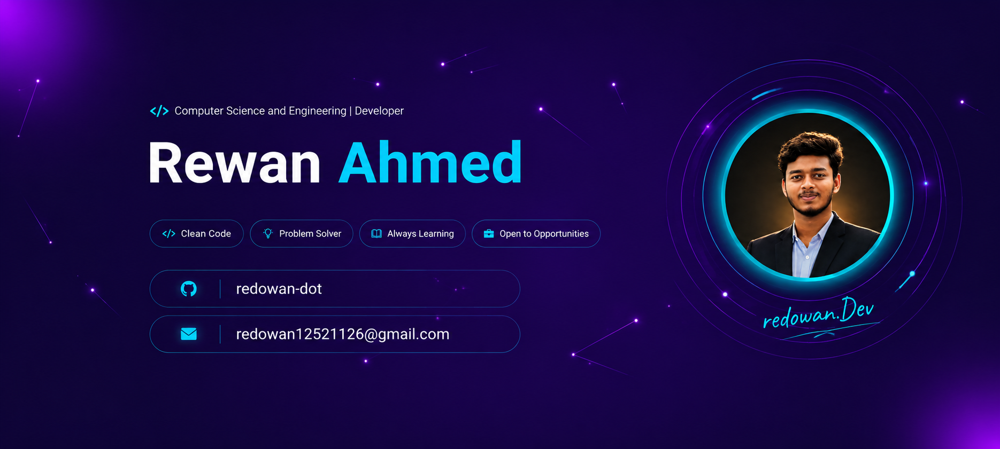
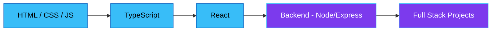

  

<h1 align="center">Rewan Ahmed</h1>
<h3 align="center">🎓 Computer Science and Engineering Student &nbsp;|&nbsp; 💻 Frontend Developer</h3>

  

  
  
  

  📍 <b>Barishal_Bangladesh</b> &nbsp;|&nbsp; 📧 <b>redowan12521126@gmail.com</b>

  
  
  

  

---

## 🙋‍♂️ About Me

I am a **Computer Science and Engineering student** and a passionate **Frontend Developer**. I build user-friendly and responsive web applications using **HTML, CSS, JavaScript, TypeScript, and React**. Alongside frontend development, I regularly practice problem-solving with **C and C++** to strengthen my programming and logical thinking skills.

Currently, I am learning **Backend and Full Stack Development** with the goal of building complete, end-to-end products in the future. I am passionate about writing **clean, maintainable code** and continuously learning new technologies to improve my skills and stay up to date with the evolving world of web development.

### 🔭 What I'm Currently Doing

- 🚀 Exploring **Next.js** to build server-side rendered React applications
- 🌐 Working on a **personal portfolio / tourism-style website** using React & TypeScript
- 🧠 Practicing **Data Structures & Algorithms** in C++
- 🔧 Learning **Node.js & Express** for backend development
- 📖 Studying full stack project architecture

---

## 🛠️ Skills

<table>
<tr>
<td valign="top" width="50%">

**Languages**

</td>
<td valign="top" width="50%">

**Frontend**

</td>
</tr>
<tr>
<td valign="top" width="50%">

**Tools & Platforms**

</td>
<td valign="top" width="50%">

**Currently Learning**

</td>
</tr>
</table>

#### 📈 Skill Proficiency

`HTML/CSS` ████████████████████ 90%
`JavaScript` █████████████████░░░ 85%
`TypeScript` ███████████████░░░░░ 75%
`React` ██████████████░░░░░░ 70%
`C / C++` █████████████████░░░ 85%
`Backend (Node/Express)` ██████░░░░░░░░░░░░░░ 30% *(learning)*

---

## 🗺️ Learning Roadmap

---

## 🎯 What I'm Focused On

| Area | Status |
|------|--------|
| Frontend Development (HTML, CSS, JS, TS, React) | ✅ Working professionally |
| Problem Solving (C / C++) | ✅ Actively practicing |
| Backend Development | 🌱 Currently learning |
| Full Stack Development | 🌱 Currently learning |
| Open to Opportunities | 🟢 Yes |

---

## 📌 Pinned Projects

> নিচে আপনার ২টা pinned repository-র জন্য জায়গা রাখা হলো। `REPO-NAME-1`, `REPO-NAME-2` এর জায়গায় আসল repo নাম বসান।

  
  

---

## 📊 GitHub Stats & Activity

  
  

  

#### 🔥 Contribution Continuity

  

<!--START_SECTION:snake-->

  

<!--END_SECTION:snake-->

#### ⚡ Performance Overview

  

  

---

## 💬 Quote

  

---

## 🤝 Connect With Me

  
  
  

  <i>Thanks for visiting my profile! ⭐ Feel free to explore my repositories.</i>

  

